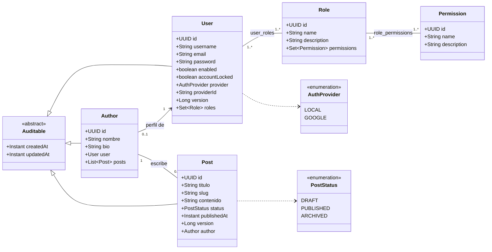

# 01 — Modelo de dominio

Estado: **aprobado e implementado**. Build verde (`mvnw test`, Boot 3.5.16 / Java 17).

## Decisiones confirmadas

| # | Decisión | Resolución |
|---|---|---|
| 1 | Stack | Spring Boot 3.5.16, Java 17, Spring Security 6.5 |
| 2 | Identificadores | `UUID` como PK de todas las entidades (sin `Long` interno) |
| 3a | Alcance de `POST_UPDATE` para AUTHOR | Solo sus propios posts, vía ownership check en `@PreAuthorize` |
| 3b | Visibilidad de borradores | Anónimo/USER: solo `PUBLISHED`. AUTHOR: + sus `DRAFT`. ADMIN: todo |
| 3c | Borrado para AUTHOR | No tiene `POST_DELETE`; retira contenido pasándolo a `ARCHIVED` |
| 3d | Registro | `/auth/register` público, ignora roles del body. ADMIN se bootstrapea aparte |
| 3e | Roles al registrarse | Todo registrado recibe **USER + AUTHOR** y su perfil `Author` automáticamente |

## Diagrama de clases

## Catálogo de autorización (sembrado por `AuthorizationDataSeeder`)

| Permiso | ADMIN | AUTHOR | USER |
|---|:--:|:--:|:--:|
| `POST_CREATE` | X | X | |
| `POST_READ` | X | X | X |
| `POST_UPDATE` | X | X (propios) | |
| `POST_DELETE` | X | | |
| `AUTHOR_CREATE` | X | | |
| `AUTHOR_READ` | X | X | X |
| `AUTHOR_UPDATE` | X | X (propio) | |
| `AUTHOR_DELETE` | X | | |
| `USER_CREATE` | X | | |
| `USER_READ` | X | | |
| `USER_UPDATE` | X | | |
| `USER_DELETE` | X | | |
| `ROLE_MANAGE` | X | | |
| `PERMISSION_MANAGE` | X | | |

Authorities efectivas = `ROLE_<rol>` por cada rol + la unión de los permisos de todos sus roles.
Como toda cuenta registrada es USER+AUTHOR, sus authorities son:
`ROLE_USER, ROLE_AUTHOR, POST_CREATE, POST_READ, POST_UPDATE, AUTHOR_READ, AUTHOR_UPDATE`.

## Pendiente explícito

- Migrar de `ddl-auto: update` a **Flyway** con `ddl-auto: validate` antes del paso de Docker.
- `git init` + repo en GitHub (bonus 11).
