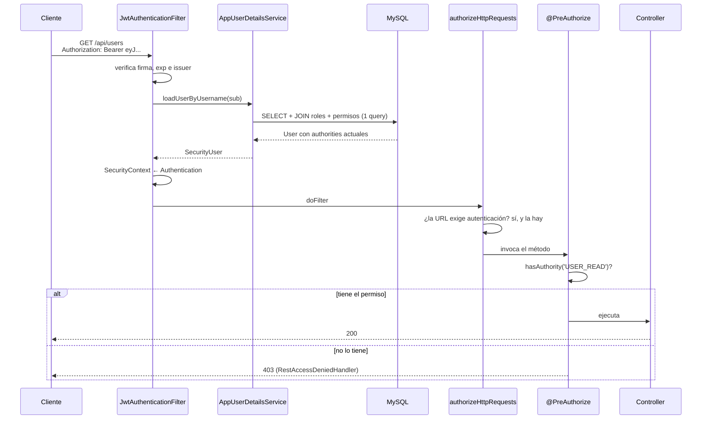

# 02 — Seguridad (JWT + autorización por permisos)

Estado: **implementado y verificado**. `mvnw test` → 15/15 verdes, sin deprecaciones.

## Flujo de una request autenticada

## Decisiones

| Decisión | Alternativa descartada | Motivo |
|---|---|---|
| Authorities desde la base en cada request | Meter roles/permisos como claims del JWT | Revocación inmediata: un permiso retirado surte efecto al instante en vez de esperar la expiración |
| Filtro (`OncePerRequestFilter`) | `HandlerInterceptor` | El interceptor corre dentro del DispatcherServlet, después de que la cadena de filtros ya rechazó el request |
| `hasAuthority('POST_CREATE')` | `hasRole('AUTHOR')` | Agregar un rol nuevo no obliga a tocar ni redesplegar los controllers |
| `SecurityUser` como adaptador | `User implements UserDetails` | No acoplar la entidad JPA al framework de seguridad |
| CSRF desactivado | Mantenerlo | El JWT va en un header que el navegador no adjunta solo. Deja de valer si el token se guarda en cookie |
| Access token de 15 min | Horas o días | Sin revocación, la ventana de un token robado es su TTL |
| BCrypt strength 12 | Default 10 | 4x iteraciones; irrelevante en un login, caro para fuerza bruta offline |
| ADMIN por bootstrap de entorno | Endpoint que otorgue ADMIN | Un `/register` capaz de dar ADMIN es escalación de privilegios abierta |

## Endpoints hasta ahora

| Método | Path | Acceso | Descripción |
|---|---|---|---|
| POST | `/auth/register` | público | Alta de cuenta. Roles fijados por el servidor: **USER + AUTHOR**. Crea también el perfil `Author`. 201 |
| POST | `/auth/login` | público | Acepta username **o** email. Devuelve `accessToken`, `expiresIn`, `authorities`. 200 |
| GET | `/api/users/me` | autenticado | Datos del usuario del token |
| GET | `/api/users` | `USER_READ` | Listado de usuarios (solo ADMIN por ahora) |

Cualquier otra ruta: `authenticated()`.

## Códigos de respuesta

| Situación | Código | Cuerpo |
|---|---|---|
| Sin token / token inválido, expirado, manipulado o de otra clave | 401 | `{"error":"Unauthorized","message":"Se requiere un token de acceso valido"}` |
| Credenciales incorrectas **o usuario inexistente** (indistinguibles a propósito) | 401 | `"Credenciales invalidas"` |
| Autenticado pero sin la authority requerida | 403 | `"No tenes permisos suficientes..."` |
| Cuenta deshabilitada o bloqueada | 403 | `"La cuenta no esta habilitada..."` |
| Validación de campos | 400 | incluye `fieldErrors` por campo |
| Username o email ya en uso | 409 | `"El username ya esta en uso"` |
| Escritura concurrente (`@Version`) | 409 | `"El recurso fue modificado por otra operacion"` |
| Cualquier otra cosa | 500 | mensaje genérico; el detalle va solo al log |

## Cobertura de tests (`AuthFlowIntegrationTest`)

Sin mocks de seguridad: recorren filtro → `AuthenticationManager` → `UserDetailsService` → base → `@PreAuthorize`.

- Registro asigna USER+AUTHOR y nunca devuelve la password
- Username duplicado → 409 (no 500)
- Validación → 400 con `fieldErrors`
- Login emite JWT con las authorities combinadas de rol + permisos
- Login con email además de username
- Password incorrecta y usuario inexistente → respuesta **idéntica**
- Sin token → 401 en JSON (no redirect al formulario)
- Payload editado para hacerse pasar por `admin` → 401
- Token `alg: none` → 401
- Token firmado con otra clave → 401
- Con token válido → 200 en `/api/users/me`
- Autenticado sin `USER_READ` → **403**, no 401
- ADMIN sí lista usuarios

## Variables de entorno

| Variable | Default | Nota |
|---|---|---|
| `APP_JWT_SECRET` | clave de dev en el yml | Base64, ≥ 32 bytes decodificados |
| `APP_JWT_ISSUER` | `debatiendo-blog-api` | Se exige al validar |
| `APP_JWT_ACCESS_TTL` | `15m` | |
| `APP_BOOTSTRAP_ADMIN_PASSWORD` | vacío | Si está vacío se genera una aleatoria y se loguea **una sola vez** |

## Pendiente

- OAuth2 con Google (punto 6) — próxima entrega
- Refresh tokens con rotación y revocación
- `PostSecurity.isOwner(...)` para el alcance "solo mis posts" — llega con el CRUD de Posts
